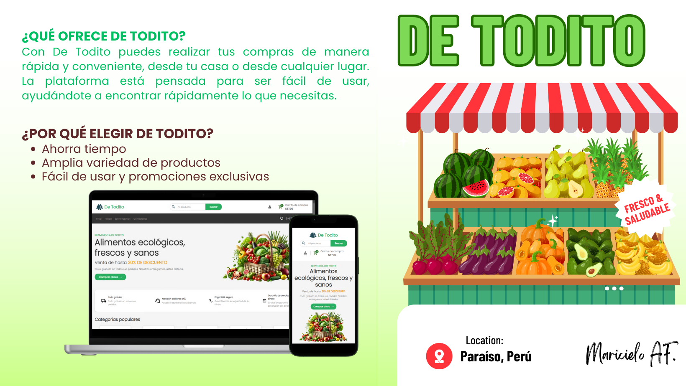

# Proyecto: De Todito - Mini Marketplace


Este repositorio contiene el proyecto **De Todito**, una tienda en línea implementada con **HTML5** y **CSS3** siguiendo un enfoque **mobile-first** y **responsive**. En este proyecto se han implementado 2 secciones clave para la página principal (Home) y la página de tienda (Shop).

## Arquitectura de Carpetas
La estructura de carpetas se organizó para mantener el orden y la escalabilidad del proyecto. A continuación se detalla cada sección:
```
├── assets/              # Contiene recursos estáticos para el proyecto
│   ├── css/             # Archivos CSS para el diseño y estilo de la página
│   ├── fonts/           # Fuentes personalizadas utilizadas en el proyecto
│   ├── icons/           # Iconos usados en la interfaz
│   └── images/          # Imágenes y gráficos empleados en la página
├── home.html            # Página principal de inicio del proyecto
├── shop.html            # Página de la tienda, muestra los productos disponibles
└── README.md            # Archivo de documentación del proyecto
```

## 🚀 Prueba Local
Para visualizar el proyecto localmente, sigue estos pasos:

Clona el repositorio o descarga los archivos directamente a tu computadora.

```
git clone https://github.com/Maricieloaf02/BOOTCAMP-FRONTEND-REACT-NTT-MARICIELO-AF.git
```
- Navega a la carpeta del proyecto en tu computadora.
- Abre el archivo home.html o shop.html en tu navegador.

*Nota*: Dado que el proyecto solo utiliza HTML y CSS, no es necesario instalar ninguna dependencia.

